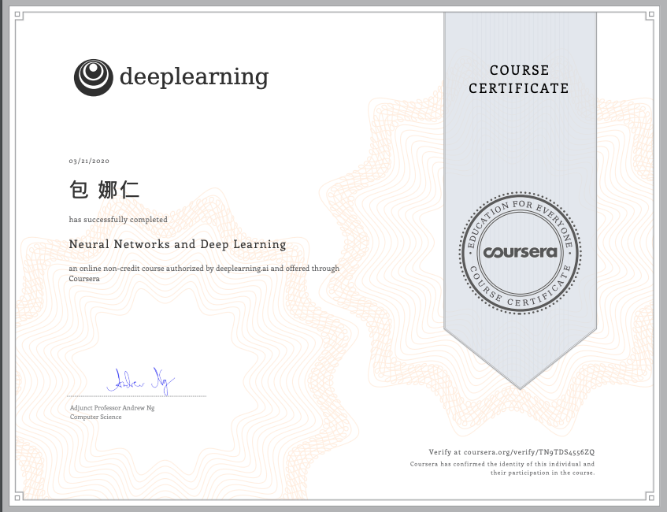

# Naren Bao

Love, Peace, Joy.
-----------------------------------------------------------------------------------
##### Introduction

- Founder of AquaAge Inc. 
- PhD student in Informatics at Nagoya University

My research interest is modeling personalized driving styles for autonomous driving. During my PhD course, I first model subjective risk levels for individuals, and I will implement a Human-in-the-Loop prototype for personalized data-driven control to combine learning based risk models with model predictive control. 
I am also the founder of AquaAge Inc. https://www.aquaage.org/

-----------------------------------------------------------------------------------
##### Publications

- Naren Bao, Dongfang Yang, Alexander Carballo, Umit Ozguner and Kazuya Takeda, “Personalized Safety-focused Control by Minimizing Subjective Risk,” in 2019 IEEE Intelligent Transportation Systems Conference (ITSC) Auckland, NZ, October 27-30, pp. 3853–3859, Oct. 2019.
- Naren Bao, Chiyomi Miyajima, Akira Tamamori, Eijiro Takeuchi, and Kazuya Takeda, ”Estimating Subjective Driving Risk Feeling using Random Forest,” 2018 IEICE General Conferences, Tokyo, Mar. 2018. 
- Naren Bao, Chiyomi Miyajima, Eijiro Takeuchi, Kazuya Takeda, Shinichiro Honda, Toshiya Yoshitani, and Masayoshi Ito,”Estimating Risk Levels Perceived by Indi- viduals for Lane Change Scenes,”The fourth Internetional Symposium on Future Active Safety Technology Toward zero traffic accidents, Nara, Sept. 2017. 
- Naren Bao, Chiyomi Miyajima, Eijiro Takeuchi, and Kazuya Takeda, ”Analysis of Individual Risk Perception during Highway Lane-Change Scenes,” The 79th National Convention of IPSJ, Nagoya, Mar. 2017. 
- Naren Bao, Daiki Hayashi, Chiyomi Miyajima, and Kazuya Takeda, ”Prediction of Individual Driving Behavior on Highway Curves,” The third Workshop on Natural- istic Driving Data Analysitics, IEEE Intelligent Vehicles Symposium (IV), Gothenburg, June 2016. 

-----------------------------------------------------------------------------------

