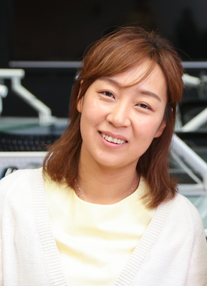
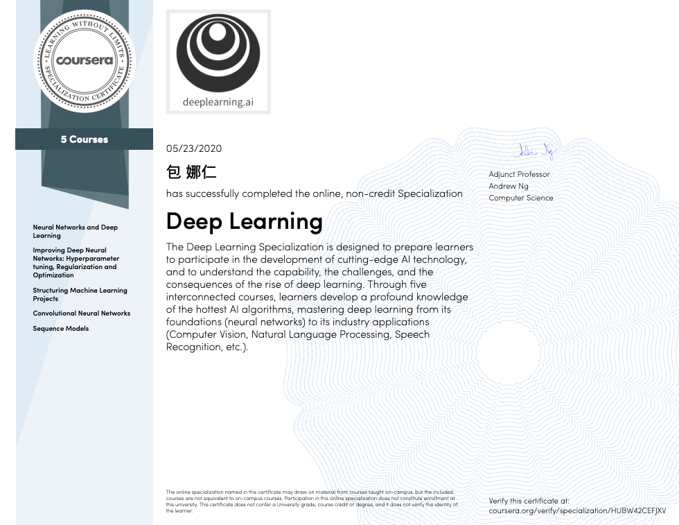
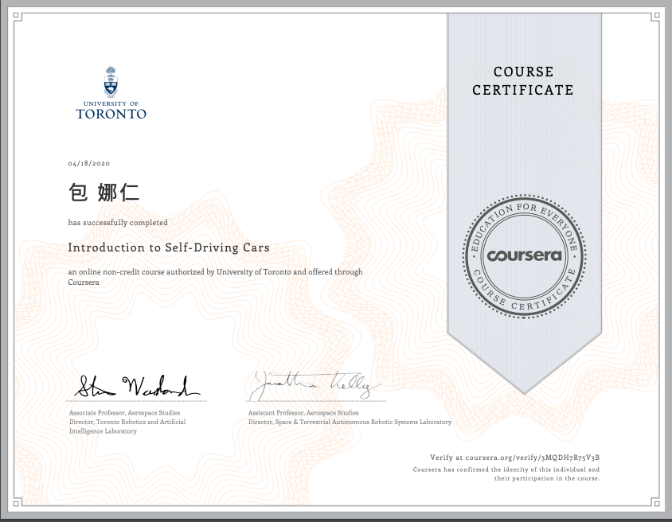

# Naren Bao, 包 娜仁

-----------------------------------------------------------------------------------
### Introduction

{: style="float:right"}

- Founder of AquaAge Inc. 
- | PhD student in Informatics at Nagoya University    |  |

My research interest is modeling personalized driving styles for autonomous driving. During my PhD course, I first model subjective risk levels for individuals, and I will implement a Human-in-the-Loop prototype for personalized data-driven control to combine learning based risk models with model predictive control. 
I am also the founder of AquaAge Inc. 

[Company homepage](https://www.aquaage.ai/)

My search information is updated in ResearchGate, which is from following. 

[ResearchGate](https://www.researchgate.net/profile/Naren_Bao2)

-----------------------------------------------------------------------------------
### Publications

------ *2020*------
- <u>Naren Bao</u>, Alexander Carballo, Chiyomi Miyajima, Eijiro Takeuchi, and Kazuya Takeda, “Personalized Subjective Driving Risk: Analysis and Prediction,” Journal of Robotics and Mechatronics, Vol.32 No.3, June, 2020.

------ *2019*------
- <u>Naren Bao</u>, Dongfang Yang, Alexander Carballo, Umit Ozguner and Kazuya Takeda, “Personalized Safety-focused Control by Minimizing Subjective Risk,” in 2019 IEEE Intelligent Transportation Systems Conference (ITSC) Auckland, NZ, October 27-30, pp. 3853–3859, Oct. 2019.

------ *2018*------
- <u>Naren Bao</u>, Chiyomi Miyajima, Akira Tamamori, Eijiro Takeuchi, and Kazuya Takeda, ”Estimating Subjective Driving Risk Feeling using Random Forest,” 2018 IEICE General Conferences, Tokyo, Mar. 2018. 

------ *2017*------
- <u>Naren Bao</u>, Chiyomi Miyajima, Eijiro Takeuchi, Kazuya Takeda, Shinichiro Honda, Toshiya Yoshitani, and Masayoshi Ito,”Estimating Risk Levels Perceived by Indi- viduals for Lane Change Scenes,”The fourth Internetional Symposium on Future Active Safety Technology Toward zero traffic accidents, Nara, Sept. 2017. 
- <u>Naren Bao</u>, Chiyomi Miyajima, Eijiro Takeuchi, and Kazuya Takeda, ”Analysis of Individual Risk Perception during Highway Lane-Change Scenes,” The 79th National Convention of IPSJ, Nagoya, Mar. 2017. 

------ *2016*------
- <u>Naren Bao</u>, Daiki Hayashi, Chiyomi Miyajima, and Kazuya Takeda, ”Prediction of Individual Driving Behavior on Highway Curves,” The third Workshop on Naturalistic Driving Data Analysitics, IEEE Intelligent Vehicles Symposium (IV), Gothenburg, June 2016. 

-----------------------------------------------------------------------------------

#### I am having fun of Coursera courses.

- Having so much fun during this 'deeplearning.ai' specialization course in Coursera taught by Prof. Andrew Ng. Such a good course organized on gaining an intuitive understanding of recurrent and convolutional neural networks including attention mechanism, transfer learning ideas. Handy programming practice such as neural machine translation, facial recognition helped me observe more details on implementation. Highly recommended course.

- Introduction to Self-driving Cars

It takes me several months to finish this self-driving introduction course, but it's totally worth it. Now I have an overview of how self-driving cars being conducted. I still need a lot to explore in this field.

